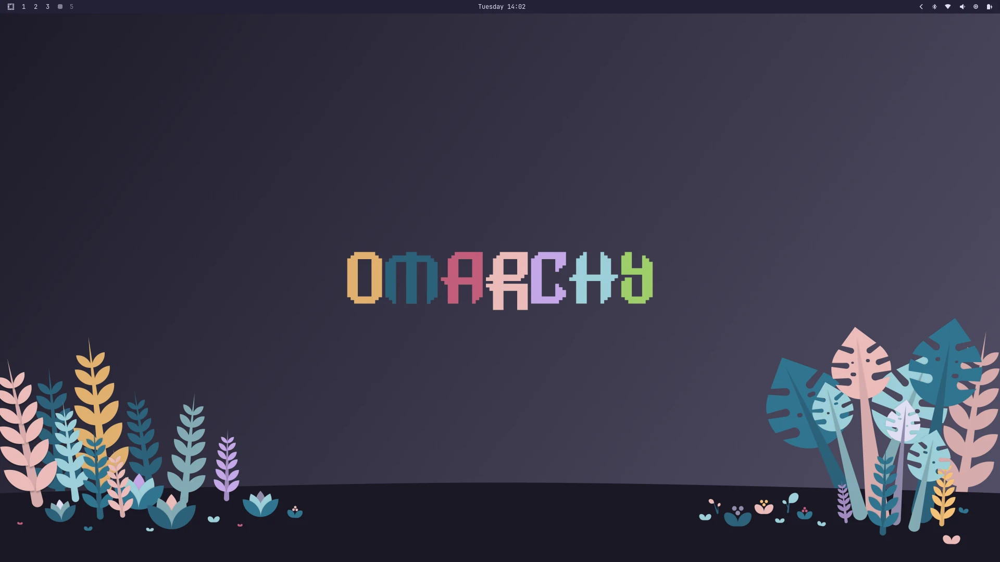
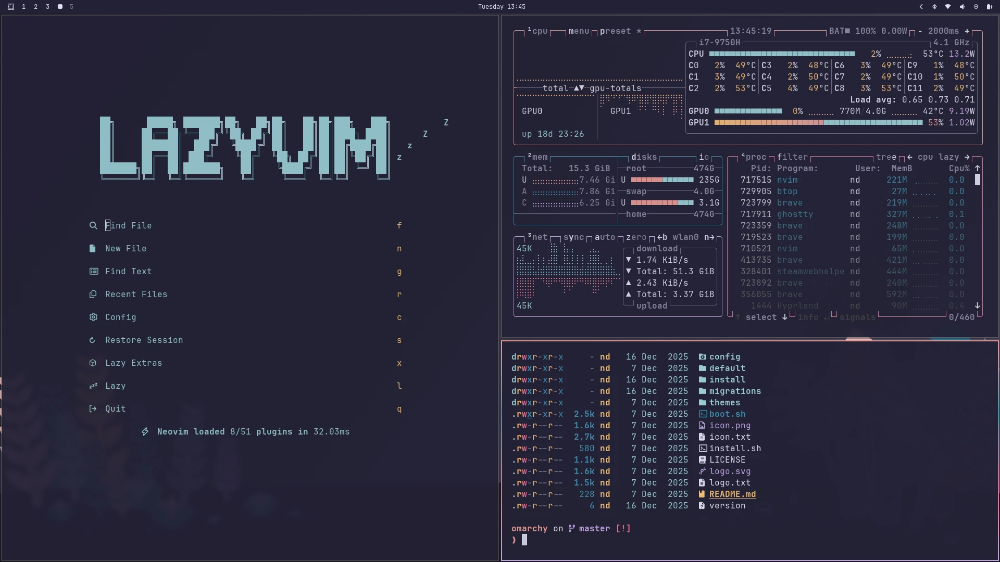

# Rose pine theme for Omarchy

A rose pine theme for [Omarchy](https://omarchy.org/).

### Moon:

Dark themed wallpaper from original repository. There aren't any specific moon themed wallpapers included.




### Color palette

Dark palette (not moon):


## Installation

Use the builtin installation script (available after version 1.4.0):

Moon:
```bash
omarchy-theme-install https://github.com/doubiedev/omarchy-rose-pine-moon
```

### Neovim configuration

To get rose pine moon theme to apply properly for Neovim you will have to adjust Omarchy's Lazyvim config. Specifically this line interferes with rose pine moon's background within `~/.config/nvim/plugin/after/transparency.lua`:

```
vim.api.nvim_set_hl(0, "Normal", { bg = "none" })
```

To fix this, you can conditionally disable it as below, and Omarchy's rose pine dawn theme should still function as normal:

```
if vim.g.colors_name ~= "rose-pine" then
    vim.api.nvim_set_hl(0, "Normal", { bg = "none" })
end
```

### Acknowledgments

- [Omarchy](https://omarchy.org/) Opinionated Arch/Hyprland Setup By DHH
- [Rose pine](https://rosepinetheme.com/) All natural pine, faux fur and a bit of soho vibes for the classy minimalist.
- [Rose Pine Dark](https://github.com/guilhermetk/omarchy-rose-pine-dark) Original fork for Omarchy rose pine main theme
